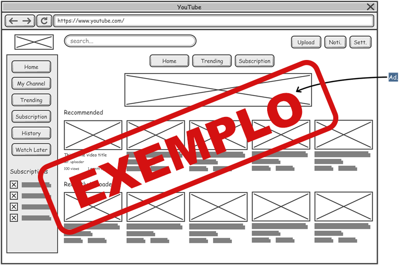

# Projeto de interface

Pré-requisitos: <a href="03-Product-design.md"> product design</a>

 Visão geral da interação do usuário pelas telas do sistema e protótipo interativo das telas com as funcionalidades que fazem parte do sistema (wireframes).

 Apresente as principais interfaces da plataforma. Discuta como ela foi elaborada de forma a atender os requisitos funcionais, não funcionais e histórias de usuário abordados na parte de <a href="03-Product-design.md"> product design</a>.

 ## User flow

O fluxo de navegação mapeia as principais etapas de interação que o usuário realiza dentro do sistema.

#### Tela de Login:

O usuário insere seu e-mail e senha para acessar sua conta. Caso não tenha uma conta, pode se registrar rapidamente.

#### Tela Principal/Dashboard:

Ao fazer login, o usuário é direcionado para o Dashboard, onde pode visualizar suas tarefas e eventos.

#### Tela de Tarefas:

O usuário pode acessar a tela de Tarefas para visualizar, criar, editar ou excluir tarefas.

## Wireframes

> ⚠️ **APAGUE ESTA PARTE ANTES DE ENTREGAR SEU TRABALHO**

São protótipos usados no design de interface para sugerir a estrutura de um site web e seu relacionamento entre suas páginas. Um wireframe web é uma ilustração que mostra o layout dos elementos fundamentais na interface.

**✳️✳️✳️ COLOQUE AQUI OS PROTÓTIPOS DE TELAS COM TÍTULO E DESCRIÇÃO ✳️✳️✳️**

##### TELA XPTO ⚠️ EXEMPLO ⚠️

Descrição para a tela XPTO

 
> **Links úteis**:
> - [Protótipos: baixa, média ou alta fidelidade?](https://medium.com/ladies-that-ux-br/prot%C3%B3tipos-baixa-m%C3%A9dia-ou-alta-fidelidade-71d897559135)
> - [Protótipos vs wireframes](https://www.nngroup.com/videos/prototypes-vs-wireframes-ux-projects/)
> - [Ferramentas de wireframes](https://rockcontent.com/blog/wireframes/)
> - [Figma](https://www.figma.com/)
> - [MarvelApp](https://marvelapp.com/developers/documentation/tutorials/)
> - [Adobe XD](https://www.adobe.com/br/products/xd.html#scroll)

### Protótipo Interativo

> ⚠️ **APAGUE ESTA PARTE ANTES DE ENTREGAR SEU TRABALHO**
>
> Um protótipo interativo apresenta o projeto das interfaces e permite ao usuário navegar pelas funcionalidades como se estivesse utilizando o software finalizado. Utilize as mesmas ferramentas de criação de wireframes para a montagem do seu protótipo interativo. Inclua o link para o protótipo interativo do projeto.

**✳️✳️✳️ COLOQUE AQUI UM IFRAME COM SEU PROTÓTIPO INTERATIVO ✳️✳️✳️**

✅ [Protótipo interativo](https://marvelapp.com/prototype/4hd6091?emb=1&iosapp=false&frameless=false)  ⚠️ EXEMPLO ⚠️
